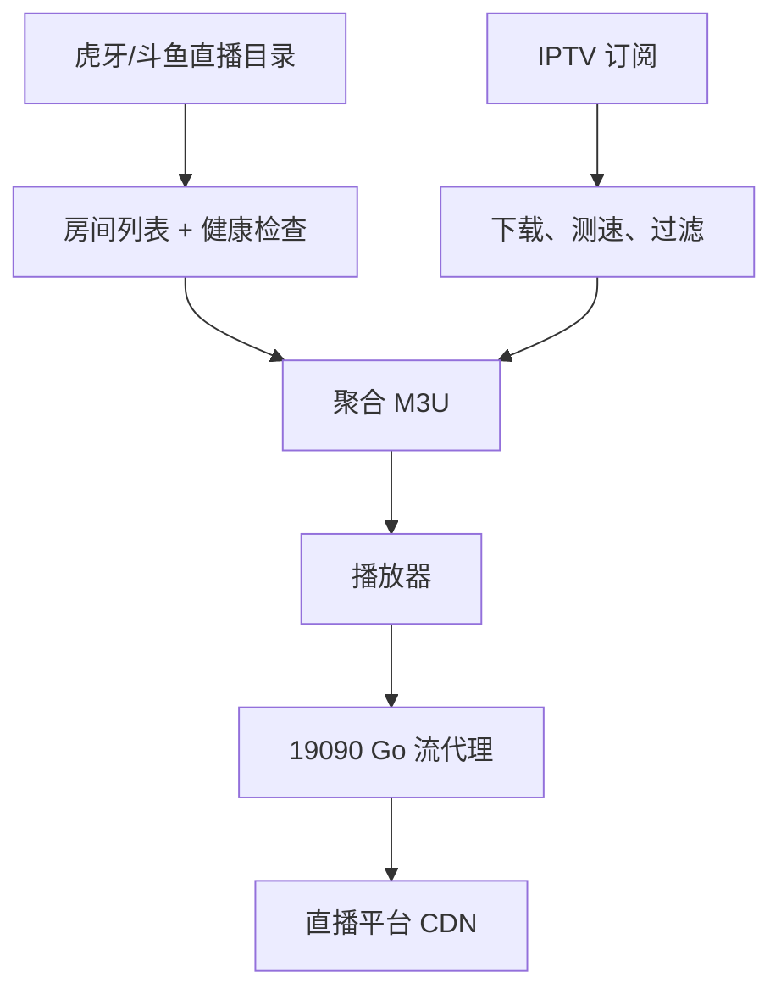
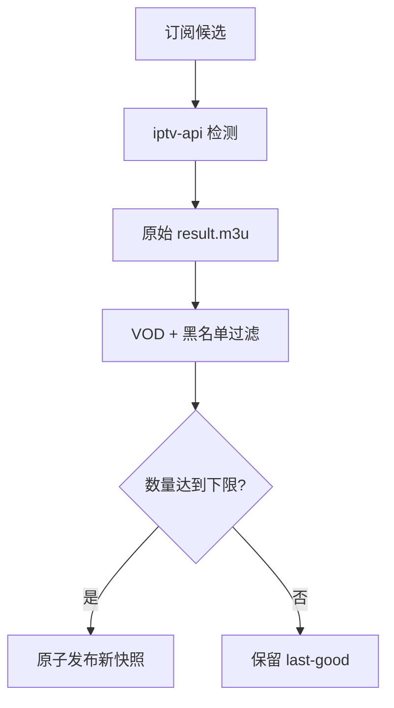

# 系统架构与直播源判断白皮书

本页回答三个问题：频道从哪里来、为什么播放器拿到的是本机代理地址、项目怎样尽量排除录播和坏源。

## 设计目标与非目标

### 设计目标

- 给播放器一个长期不变的聚合入口；
- 在播放时解析会过期的平台地址；
- 新数据异常时保住最后一次可用结果；
- amd64/arm64 使用同一套部署方式；
- 配置、日志和结果全部持久化；
- 不把部署者的 IP、私人路径和密钥写进仓库；
- 保留已有 HTTP 路径和主要端口，降低升级成本。

### 非目标

- 不提供或保证任何第三方频道内容；
- 不绕过平台账号、付费、地区或授权限制；
- 不承诺所有房间永久可播；
- 不把“URL 能返回视频”宣传成百分之百真直播识别；
- 不内置公网用户认证、计费或多租户权限系统。

## 先用一句话理解

项目不是保存一批永久不变的播放链接，而是保存“直播房间编号和电视源候选”。播放器请求频道时，服务再解析最新地址或转发已经检测过的电视源。

## 名词解释

| 名词 | 通俗解释 |
|---|---|
| M3U | 文本格式的频道清单，一条频道信息后面跟一条播放 URL |
| 房间号 | 虎牙/斗鱼直播间的稳定编号，不是最终 CDN 地址 |
| CDN 地址 | 平台真正的视频地址，通常带签名并会过期 |
| 流代理 | 播放器连接本项目，本项目再连接直播平台 |
| IPTV 候选源 | 从订阅中收集、尚未完全验证的电视 URL |
| 桥接 | 把 `iptv-api` 原始结果过滤后发布到最终聚合列表 |
| last-good | 最后一次通过数量和格式检查的可用快照 |
| VOD | 点播或录播文件，不是当前实时直播 |

## 三类频道不是同一条链路

| 类型 | 目录来源 | 播放时经过本项目代理 | 更新方式 |
|---|---|---|---|
| 虎牙 | 官方当前开播目录 | 是，端口 19090 | 目录定时同步，播放时重新签名并无缝续流 |
| 斗鱼 | 官方当前开播目录 | 是，端口 19090 | 目录同步 + 后台真实拉流白名单 |
| IPTV | 用户/上游订阅 | 通常不经过平台代理 | `iptv-api` 下载测速，再过滤发布 |

## 总体数据流



IPTV 频道通常从播放器直接访问上游 URL；虎牙和斗鱼频道先连接本项目代理，因此播放器必须能访问 19090。

## 容器内有哪些进程

| 组件 | 端口 | 主要职责 |
|---|---:|---|
| Go `livetv` | 35455 | 生成聚合/单平台 M3U，解析房间地址，提供持久头像缓存 |
| Go `livetv` | 19090 | 虎牙/斗鱼 FLV/HLS 转发、重新签名、断流续接和时间戳修正 |
| Python `stream-proxy.py` | 19091 | 旧版虎牙直通兼容，不再写入新生成的 M3U |
| Python `sync_channels.py` | 无 | 获取虎牙/斗鱼当前直播目录 |
| `iptv-api` | 8080/5180 | 收集、测试、排序并输出 IPTV |
| `filter_iptv.py` | 无 | 过滤明显 VOD、坏格式和 URL 黑名单 |
| nginx | 8081 | 给播放器提供稳定的 `/allinone.m3u` |
| `entry.sh` | 无 | 初始化、启动、监控和重启所有核心进程 |

35456 是旧 Python 解析兼容接口，19091 是旧虎牙流兼容端口。新部署主要使用 8081 和 19090。

## 玩家点击一个虎牙频道时

1. 播放器先下载 `http://服务器:8081/allinone.m3u`。
2. 服务按分类预解析每组前几个频道，并复用解析站点的 TCP/TLS 连接。
3. 虎牙条目的 URL 指向 `http://服务器:19090/stream/huya/房间号`。
4. Go 解析器读取结构化房间数据，按 2026 签名算法生成带时效的 H.264 FLV 地址；同一房间的并发探测只解析一次。
5. 代理检查上游不是 HTML 错误页、空响应或测试回退视频。
6. CDN 断开时，代理重新签名并在同一客户端连接内从关键帧续接，同时修正 FLV 时间戳。
7. 房间下播或所有重试失败时返回明确错误，不再跳到测试录像。

为什么不把 CDN 地址直接写进 M3U？因为平台签名会过期，保存后很快失效；本机代理可以在播放时重新获取。

## 玩家点击一个斗鱼频道时

1. `sync_channels.py` 获取官方当前开播目录。
2. Go 健康检查重新解析每个候选房间。
3. 服务通过本机代理实际拉流约 4 秒。
4. HTTP 必须成功，且收到的数据超过最低字节量，房间才进入存活白名单。
5. 聚合 M3U 优先只输出新鲜白名单中的斗鱼房间。
6. 播放器访问 19090 后，代理处理重新解析、断流和时间戳连续性。

白名单不存在或过期时，程序会暂时回退到目录数据，避免一次健康检查异常把斗鱼列表清空。播放时仍会重新解析，离线房间不会变成测试录像。

## IPTV 是怎样进入最终列表的



`iptv-api` 负责范围较广的检查，例如连接、速度、分辨率和 HLS 状态。本项目的桥接过滤器再检查：

- M3U 格式是否完整；
- `EXTINF` 是否声明正时长；
- URL 是否指向常见视频文件；
- URL 是否命中用户黑名单；
- 剩余频道数是否达到 `IPTV_MIN_CHANNELS`。

只有全部通过才会用临时文件原子替换 `.iptv-result.m3u`。中途失败不会先清空旧文件。

## “真直播”到底能判断到什么程度

网络程序看不到人的语义理解，只能观察协议和数据行为：

| 情况 | 识别能力 | 依据 |
|---|---|---|
| URL 已失效 | 强 | HTTP、超时、实际数据量 |
| 返回网页而不是视频 | 强 | Content-Type、FLV 魔数 |
| MP4/MKV 等文件型录播 | 强 | 扩展名和 URL 结构 |
| M3U 明确写了节目总时长 | 强 | 正时长 `EXTINF` |
| HLS 已结束或短占位片 | 中等 | `ENDLIST`、分片和时长特征 |
| 一直产生新分片的循环录像 | 无法保证 | 协议行为与真直播可能完全一致 |

因此“可播放”不等于“内容一定是实时直播”。人工确认的循环源应加入：

```text
/data/lnmp/applecms/iptv-blocklist.txt
```

这种可配置规则比把个人源域名硬编码进项目更安全，也便于随时撤销。

## 数据如何保存

```text
/data/
├── iptv-api/
│   ├── config/                 # 订阅、测速、EPG 配置
│   └── output/result.m3u       # 原始 IPTV 结果
└── lnmp/
    ├── allinone/
    │   ├── channels.json       # 当前虎牙/斗鱼房间
    │   ├── logos/              # 首次访问后永久保留的主播头像
    │   └── hls/                # 临时 HLS 分片
    ├── applecms/
    │   ├── .iptv-result.m3u    # 最终 IPTV 快照
    │   ├── douyu-alive.txt     # 斗鱼存活白名单
    │   ├── .douyu-health.stamp # 白名单更新时间
    │   └── iptv-blocklist.txt  # 用户黑名单
    └── logs/                   # 组件日志
```

Docker 挂载 `./data:/data` 后，重建容器不会丢失这些内容。

## 更新周期和自愈

| 任务 | 周期/触发 |
|---|---|
| 虎牙/斗鱼目录同步 | 启动时一次，之后每 6 小时 |
| 斗鱼全量健康检查 | 启动时、定时以及白名单过期后触发 |
| IPTV 更新 | 由持久化 `config.ini` 控制，默认约 12 小时 |
| IPTV 桥接 | 首次结果出现后立即执行，之后每 15 分钟检查 |
| 进程守护 | 每 20 秒检查核心进程 |
| Docker 健康检查 | 检查 PID、M3U 和内部 Web 服务 |

子进程退出后 `entry.sh` 会重启它。健康检查不会把“nginx 还活着”误判成整个系统正常。

## 可靠性设计

| 风险 | 处理方式 | 剩余风险 |
|---|---|---|
| 上游目录偶发返回空数据 | 最低数量检查，不覆盖旧 `channels.json` | 首次启动没有旧数据时仍会为空 |
| IPTV 一次测速大量失败 | `IPTV_MIN_CHANNELS` + last-good | 长期源失效需要人工更换订阅 |
| 写文件中途退出 | 临时文件完成后原子替换 | 磁盘损坏不在应用层解决范围 |
| 子进程崩溃 | `entry.sh` 每 20 秒守护重启 | 持续崩溃仍需根据日志修复根因 |
| CDN 地址过期 | 播放时重新解析和短期缓存 | 平台接口变更需要升级解析逻辑 |
| 换台重复解析 | 连接复用、同房间请求合并、按组有限预热 | 仍需等待主播下一个视频关键帧 |
| 头像源失效/变化 | 首次请求后原子写入 `/data`，后续不覆盖 | 首次请求仍依赖平台图片 CDN |
| 某架构镜像不可构建 | amd64/arm64 分开 CI 验证 | 上游基础镜像撤回仍会阻塞构建 |
| Registry 凭证缺失 | 发布前显式校验并报出变量名 | Token 权限范围仍由平台控制 |

## 地址为什么能跟随 IP/域名

M3U 生成时读取当前 HTTP 请求的 `Host`。因此：

```text
用 192.168.1.50 下载 → 频道 URL 使用 192.168.1.50
用 tv.example.com 下载 → 频道 URL 使用 tv.example.com
用 IPv6 下载          → 频道 URL 使用 [IPv6]
```

反向代理不能保留 Host 时才需要设置 `PUBLIC_HOST`。宿主端口与容器端口不同时，`PUBLIC_AIO_PORT`、`PUBLIC_PROXY_PORT`、`PUBLIC_PY_PORT` 和 `PUBLIC_LIVETV_PORT` 决定写进 M3U 的外部端口。

## 安全边界

- 项目没有内置用户认证；
- 8080 管理页不应暴露到不可信公网；
- 外部订阅 URL 可能包含访问参数，应只保存在 `/data`；
- 容器启用 `no-new-privileges`，但仍应及时升级基础镜像；
- 不要在代码、Compose、Issue 或日志中公开密码、Token、SSH 私钥和私人 IP/路径。

## 当前状态与路线

### P0：可部署、可恢复、可验证

- 已完成多架构基础镜像和 amd64/arm64 CI 验证；
- 已移除离线房间跳转测试录像的行为；
- 已增加 IPTV VOD/黑名单过滤和 last-good；
- 已统一 `/data` 持久化配置、结果和日志；
- 已修复 GitHub Environment Secrets 读取；
- 已将 Docker Hub 与阿里云发布拆成独立 job，单端认证失败不阻塞另一端；
- 已建立 README、部署、配置、Termux、架构和排障文档。

### P1：更容易运营

- 增加不泄露订阅和密钥的一键诊断报告；
- 为源同步、健康检查、桥接增加结构化状态接口；
- 增加版本化发布、变更日志和自动回滚说明；
- 增加真实容器启动后的端到端冒烟测试。

### P2：更智能的源质量管理

- 建立按频道的连续成功率、延迟和失效历史；
- 对 HLS 分片连续性和内容指纹做可选的循环源辅助判断；
- 提供可视化状态页和手动禁用/恢复频道；
- 增加 EPG 匹配质量报告和频道别名规则；
- 评估拆分单容器进程，提供更标准的可观测性和横向扩展方式。

P2 的内容指纹只能提高疑似循环源的识别率，仍不能保证理解视频语义或百分之百判定实时性。
