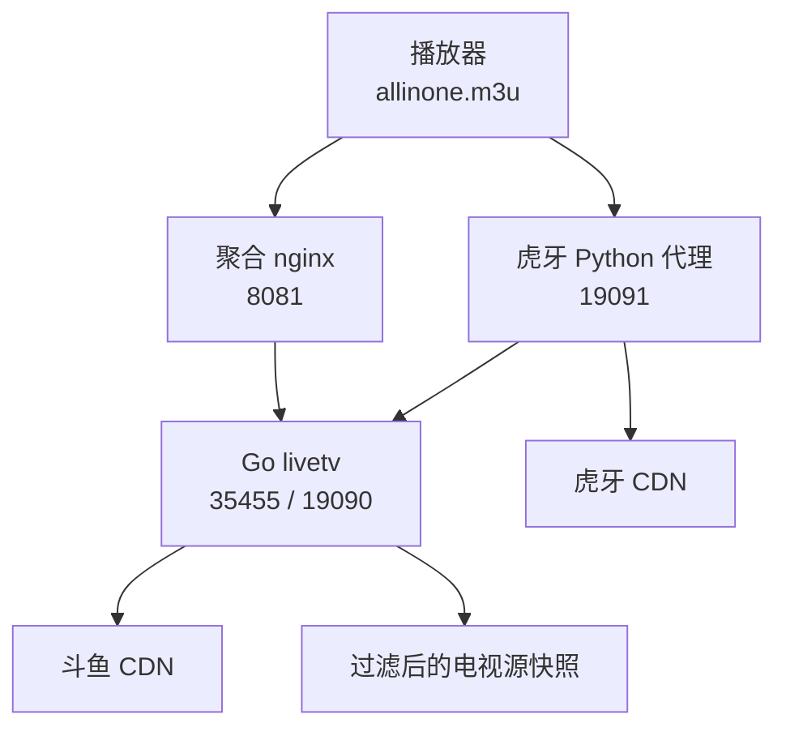
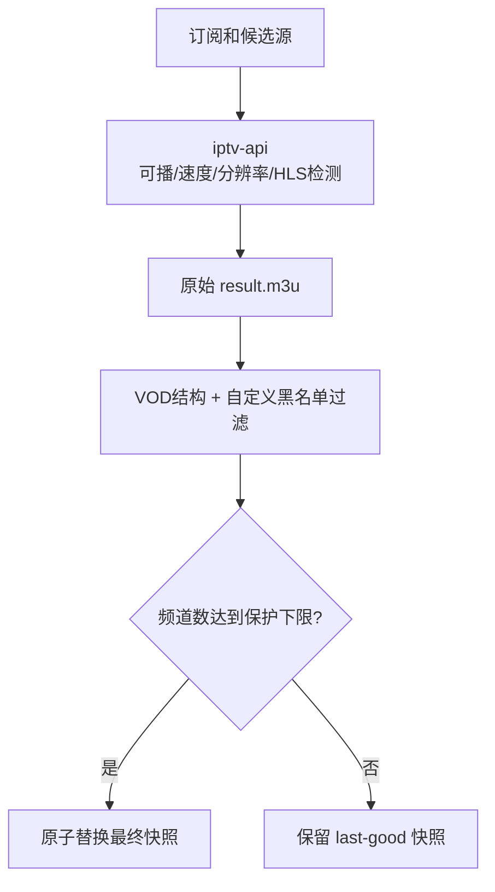

# 系统架构与源检测流程

这篇文档解释每个进程做什么、播放请求怎样流转，以及项目所说的“直播源检测”具体能检测到什么。

## 总体结构



容器内还有一套 `iptv-api`：它在后台收集和测试电视源，Web 页面由 8080 提供。它不会直接修改播放器正在读取的文件，而是先生成候选结果，通过本项目的保护性桥接后才进入最终列表。

## 各组件职责

| 组件 | 端口 | 职责 |
|---|---:|---|
| Go `livetv` | 35455 | 生成单平台/聚合 M3U，解析房间地址 |
| Go `livetv` | 19090 | 斗鱼 FLV 转发、断流重连、HLS 输出 |
| Python `stream-proxy.py` | 19091 | 虎牙 FLV/HLS 转发 |
| Python `sync_channels.py` | 无 | 从官方目录获取当前开播的虎牙/斗鱼房间 |
| `iptv-api` | 8080/5180 | 收集、测速、排序并生成电视源 |
| nginx | 8081 | 提供稳定的 `/allinone.m3u` 入口 |
| `filter_iptv.py` | 无 | 发布前过滤明显 VOD 和黑名单 URL |
| `entry.sh` | 无 | 初始化持久化目录、启动和守护全部进程 |

35456 是 Python 旧解析接口，为已有调用保留。新部署的聚合列表主要使用 Go 解析器和 19090/19091 流代理。

## 一次播放请求发生了什么

### 虎牙

1. 播放器下载 `:8081/allinone.m3u`。
2. 列表中的虎牙频道指向 `:19091/stream/huya/<房间号>`。
3. Python 代理向本机 Go 解析器请求最新签名地址。
4. 代理校验返回内容必须是 FLV，而不是网页、M3U8 测试片或空响应。
5. 校验通过后把字节流转给播放器；客户端断开时同时终止上游进程。

### 斗鱼

1. `sync_channels.py` 先获取官方当前开播目录。
2. Go 健康检查逐个重新解析候选房间。
3. 候选源通过本机代理实际拉取 4 秒，状态为 200 且超过 200 KB 才进入存活名单。
4. 聚合列表只输出新鲜存活名单里的房间；名单缺失或过期时暂时全量输出，避免错误检测导致整个列表为空。
5. 播放器访问 `:19090/stream/douyu/<房间号>`，代理在 CDN 断流时重新获取签名并维持 FLV 时间戳单调。

### IPTV 电视源



`iptv-api` 默认每 12 小时运行一次。`entry.sh` 始终启动这个长期进程，容器重启不会因为旧快照还存在而停止更新。桥接脚本每 15 分钟检查新结果，首次生成完成后也会立即桥接。

## “真直播”检测的边界

这里必须区分三个概念：

| 状态 | 本项目能否识别 | 判定依据 |
|---|---|---|
| 地址失效/无法播放 | 能 | HTTP、实际字节流、速度、ffprobe |
| 明显文件型录播/VOD | 能 | 正时长 `EXTINF`、视频文件扩展名、黑名单 |
| 短广告/无信号循环 HLS | 部分能 | 上游 HLS `ENDLIST`、时长和关键词检查 |
| 长时间循环但协议持续更新 | 不能保证 | 协议形态与正常直播相同，需要人工确认内容 |

因此，项目不会把“能下载”直接等同于“内容一定是真直播”。对已知循环源，应把稳定域名或路径加入持久化黑名单；这是比写死在代码中更安全、也更方便维护的处理方式。

## 数据与状态

所有运行数据从 `DATA` 派生；容器默认 `DATA=/data`：

```text
/data/
├── iptv-api/
│   ├── config/                 # 上游配置，首次启动复制默认值
│   └── output/                 # 上游原始输出
└── lnmp/
    ├── allinone/
    │   ├── channels.json       # 当前开播房间
    │   └── hls/                # 临时 HLS 分片
    ├── applecms/
    │   ├── .iptv-result.m3u    # 最终电视源快照
    │   ├── douyu-alive.txt     # 斗鱼存活房间
    │   ├── .douyu-health.stamp # 健康检查时间
    │   └── iptv-blocklist.txt  # 用户维护的 URL 黑名单
    └── logs/
```

更新 `channels.json` 和最终电视源都使用临时文件加原子替换。网络失败、返回数量过少或结果格式错误时，已有文件不会被截断。

## 进程守护和健康检查

PID 1 是 `entry.sh`。它每 20 秒检查七个核心进程：

- `iptv-api` 更新器、nginx、Flask API
- Go `livetv`
- 虎牙解析兼容服务、虎牙流代理
- 聚合 nginx

子进程退出后会重新启动。Docker 健康检查不仅访问网页，还校验所有 PID、聚合 M3U 头和 `iptv-api` 页面，避免“nginx 还活着但核心服务已死”的假健康。

## 网络与地址生成

M3U 默认使用客户端请求中的 `Host`，所以用局域网 IP、域名或 IPv6 地址访问时，列表会跟随该地址。IPv6 字面量会自动补方括号。

容器内部端口和宿主机映射端口不同时，`PUBLIC_AIO_PORT`、`PUBLIC_PROXY_PORT`、`PUBLIC_PY_PORT` 决定写进 M3U 的端口。仓库内 Compose 已自动把宿主机端口传给这些变量。
